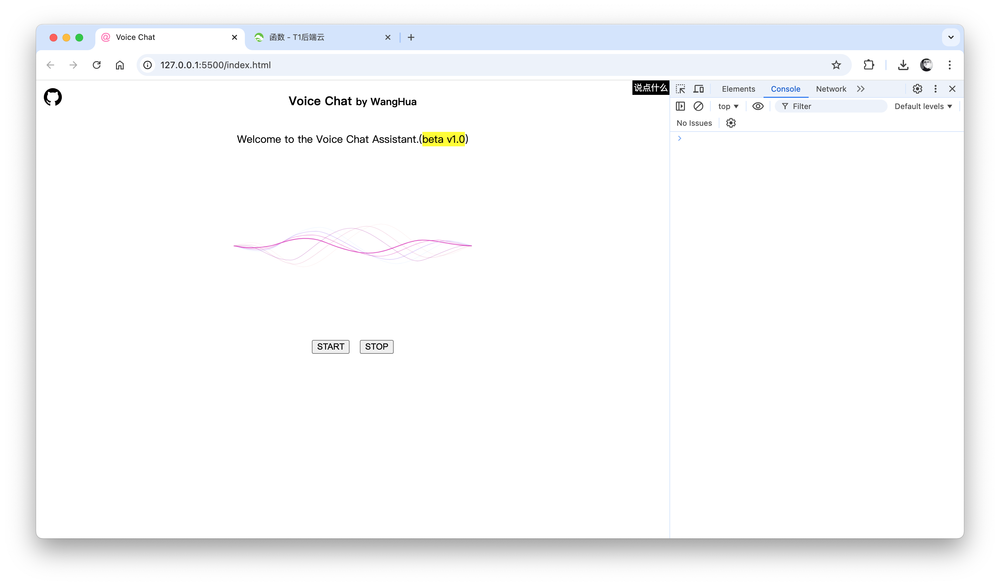

# Voice Chat

这是一个基于 `Chrome SpeechRecognition API` 实现的语音识别智能助手简易 Demo，接入 Kimi AI 及第三方语音合成实现的简易语音对话智能助手。

## 预览图



## 部署

该程序使用 <a href="https://w.t1y.net/">T1 后端云</a> 云函数（FaaS）实现，故此你需要前往 <a href="https://w.t1y.net/">T1 后端云</a> 新建一个名为 `voice` 的云函数（代码详见 ./faas/voice.jsx），并替换 `index.html` 代码中 `axios` 请求中 `url` 中的 `1001` 为你的实际应用 ID 即可。

## 目录结构

```bash
.
├── README.md
├── animation
│   └── voice.json
├── css
│   └── style.css
├── faas
│   └── voice.jsx
├── image
│   └── sc.png
├── index.html
├── js
│   ├── axios.min.js
│   ├── axios.min.js.map
│   └── lottie.min.js
└── voice
    ├── error.mp3
    └── hello.mp3
```
